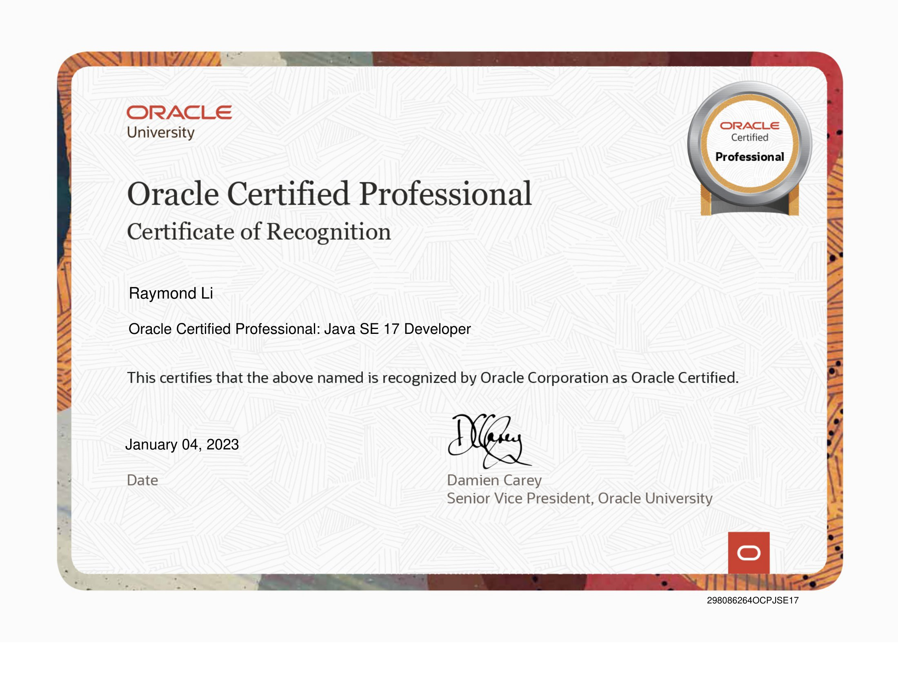

# Java Certificate Projects
This repository includes all my work while working towards my Oracle Certified Professional Java SE 17 Developer certificate

## What I had to know
**Handling date, time, text, numeric and boolean values:**

* Use primitives and wrapper classes including Math API, parentheses, type promotion, and casting to evaluate arithmetic and boolean expressions
* Manipulate text, including text blocks, using String and StringBuilder classes
* Manipulate date, time, duration, period, instant and time-zone objects using Date-Time API

**Controlling Program Flow:**

* Create program flow control constructs including
  * if/else
  * switch statements
  * expressions
  * loops
  * break statements
  * continue statements

**Utilizing Java Object-Oriented Approach:**

* Declare and instantiate Java objects including nested class objects
* Explain the object life-cycle including creation, reassigning references, and garbage collection
* Create classes and records, and define and use instance and static fields and methods, constructors, and instance and static initializers
* Implement overloading, including var-arg methods
* Understand variable scopes, use local variable type inference, apply encapsulation, and make objects immutable
* Implement inheritance, including abstract and sealed classes
* Override methods, including that of Object class
* Implement polymorphism and differentiate object type versus reference type
* Perform type casting, identify object types using instanceof operator and pattern matching
* Create and use interfaces, identify functional interfaces, and utilize private, static, and default interface methods
* Create and use enumerations with fields, methods and constructors

**Handling Exceptions:**

* Handle exceptions using
*   try/catch/finally
*   try-with-resources
*   multi-catch blocks, including custom exceptions

**Working with Arrays and Collections:**

* Create Java arrays, List, Set, Map, and Deque collections, and add, remove, update, retrieve and sort their elements

**Working with Streams and Lambda expressions:**

* Use Java object and primitive Streams, including lambda expressions implementing functional interfaces, to supply, filter, map, consume, and sort data
* Perform decomposition, concatenation and reduction, and grouping and partitioning on sequential and parallel streams

**Packaging and deploying Java code and use the Java Platform Module System:**

* Define modules and their dependencies, expose module content including for reflection. Define services, producers, and consumers
* Compile Java code, produce modular and non-modular jars, runtime images, and implement migration using unnamed and automatic modules

**Managing concurrent code execution:**

* Create worker threads using Runnable and Callable, manage the thread lifecycle, including automations provided by different Executor services and concurrent API
* Develop thread-safe code, using different locking mechanisms and concurrent API
* Process Java collections concurrently including the use of parallel streams

**Using Java I/O API:**

* Read and write console and file data using I/O Streams
* Serialize and de-serialize Java objects
* Create, traverse, read, and write Path objects and their properties using java.nio.file API

**Accessing databases using JDBC:**

* Create connections, create and execute basic, prepared and callable statements
* Process query results and control transactions using JDBC API

**Implementing Localization:**

* Implement localization using locales and resource bundles
* Parse and format messages, dates, times, and numbers including currency and percentage values

**Miscellaneous:**

* Understand the basics of Java Logging API
* Use Annotations such as Override, Functionalnterface, Deprecated, SuppressWarnings, and SafeVarargs
* Use generics, including wildcards
